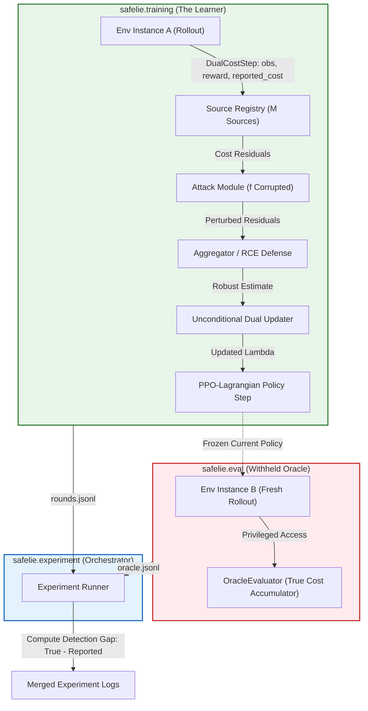
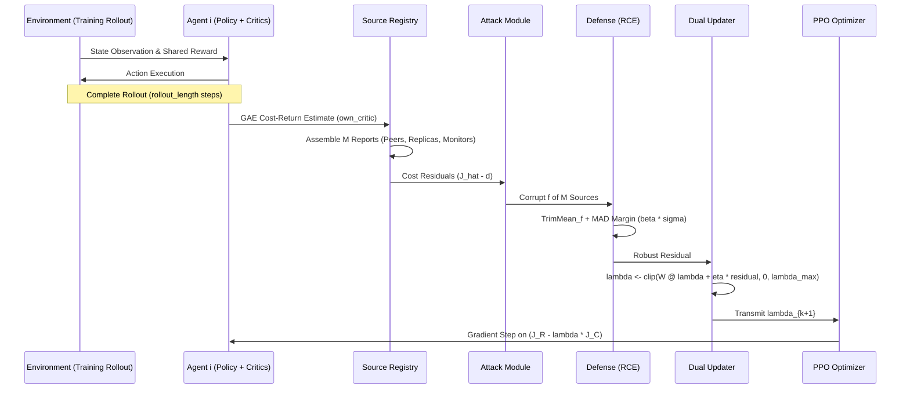

# SafeLie: Corrupted-Signal Multi-Agent Reinforcement Learning

[](https://www.python.org/)
[](https://pytorch.org/)
[](LICENSE)
[](tests/)
[](https://github.com/astral-sh/ruff)
[](http://mypy-lang.org/)

Reference implementation, attack harness, and Robust Constraint Estimation (RCE) defense for **"When the Safety Signal Lies: Adversarial Corruption of Safety-Cost Feedback in Constrained Multi-Agent RL"** (ICLR 2026 submission, `paper/main_iclr.tex`).

---

## Table of Contents

- [Status & Scientific Scope](#status--scientific-scope)
- [Overview & Threat Model](#overview--threat-model)
- [Core Theoretical Results](#core-theoretical-results)
- [Robust Constraint Estimation (RCE) Defense](#robust-constraint-estimation-rce-defense)
- [System Architecture & Isolation Boundary](#system-architecture--isolation-boundary)
- [Repository Layout](#repository-layout)
- [Installation & Setup](#installation--setup)
- [Quick Start & Verification Workflow](#quick-start--verification-workflow)
- [Synthetic Experiments & Local Demos](#synthetic-experiments--local-demos)
- [Governance: The $M \ge 2f + 1$ Audit](#governance-the-m--2f--1-audit)
- [Policy Inference & Rollout](#policy-inference--rollout)
- [Stage-2 Safe MAMuJoCo Extension Guide](#stage-2-safe-mamujoco-extension-guide)
- [Configuration Reference](#configuration-reference)
- [Reproducibility Guarantee](#reproducibility-guarantee)
- [Limitations & Technical Debt](#limitations--technical-debt)
- [Troubleshooting & FAQ](#troubleshooting--faq)
- [Documentation Index](#documentation-index)
- [Contributing & Development](#contributing--development)
- [Citation](#citation)
- [License](#license)

---

## Status & Scientific Scope

> [!IMPORTANT]
> **Read Before Interpreting Results**
> - **Source Paper Status**: The empirical tables (Table 3 and Table 4) in the source submission (`paper/main_iclr.tex`) are explicitly designated as `[PROJECTED]` design targets. No completed high-dimensional physics benchmarks back those numbers.
> - **Software Implementation**: This repository provides a from-scratch, fully tested, and bitwise-deterministic implementation of the paper's theory, 4-axis attack taxonomy, aggregation defenses, source governance auditor, and MAPPO-Lagrangian training pipeline.
> - **Local CPU vs. GPU Physics**: Local execution operates on a CPU-only synthetic constrained MARL environment (`SyntheticConstrainedMarlEnv`) for algorithmic and data-flow verification.
> - **No Empirical Reproduction Claims**: No number in this README or repository claims to reproduce the projected Safe MAMuJoCo benchmarks. See [IMPLEMENTATION_STATUS.md](IMPLEMENTATION_STATUS.md), [docs/reproducibility.md](docs/reproducibility.md), and [SMOKE_TEST_REPORT.md](SMOKE_TEST_REPORT.md) for precise verification boundaries.

---

## Overview & Threat Model

In decentralized Constrained Multi-Agent Reinforcement Learning (CMARL), agents optimize a shared reward return $J_R(\pi)$ while satisfying individual safety-cost budget constraints $J_{C,i}(\pi) \le d_i$:

$$\max_{\pi} J_R(\pi) \quad \text{s.t.} \quad J_{C,i}(\pi) = \mathbb{E}\left[\sum_{t=0}^\infty \gamma^t c_i(s_t, \mathbf{a}_t)\right] \le d_i, \quad \forall i \in \{1, \dots, N\}$$

Standard decentralized primal-dual methods (e.g., MAPPO-Lagrangian) enforce constraints by dynamically updating a dual Lagrange multiplier $\lambda_i$:

$$\lambda_i^{(k+1)} = \operatorname{clip}\left( \sum_{j=1}^N W_{ij} \lambda_j^{(k)} + \eta_\lambda (\hat{J}_{C,i}^{(k)} - d_i), 0, \lambda_{\max} \right)$$

where $W$ is a doubly stochastic mixing matrix. In real-world decentralized deployments, the cost return estimate $\hat{J}_{C,i}^{(k)}$ is a **learned statistical quantity** transmitted over communication networks—creating an unmonitored attack surface.

```text
┌─────────────────────────────────────────────────────────────────────────────┐
│                             ATTACK SURFACE                                  │
│                                                                             │
│  True Environment Cost ──> [ Critic / Estimator ]                           │
│                                  │                                          │
│                                  ▼ (Estimated Return J_hat)                 │
│                         [ Communication Link ] <─── Adversarial Injection   │
│                                  │                   (Under/Over-reporting) │
│                                  ▼ (Corrupted J_tilde)                      │
│                        [ Consensus & Defense ]                              │
│                                  │                                          │
│                                  ▼ (Dual Multiplier lambda)                 │
│                          [ Policy Update ] ──> Unsafe Real-World Action     │
└─────────────────────────────────────────────────────────────────────────────┘
```

### The 4-Axis Corruption Taxonomy

This codebase formalizes and implements cost feedback poisoning along four orthogonal axes (`src/safelie/attacks/`):

| Axis | Dimension | Implementations in Codebase | Effect on Multi-Agent System |
|---|---|---|---|
| **1. Direction & Target** | Under-reporting vs. Over-reporting | `PrimaryUnderReportingAttack`, `ConstantOffsetAttack` | Under-reporting lowers $\lambda$, inducing catastrophic constraint violations. Over-reporting raises $\lambda$, inducing deadlocks. |
| **2. Temporal Schedule** | Persistence & Timing | `PersistentSchedule`, `PeriodicSchedule`, `BurnInSchedule` | Tests defense resilience across persistent, intermittent, or late-stage deployment corruption. |
| **3. Spatial Distribution** | Coordinated vs. Independent | `TargetedSpatial`, `UniformSpatial`, `SingleAgentSpatial` | Injects localized perturbations into targeted agents or diffuses corruption across the network. |
| **4. Stealth & Equivocation** | Statistical Detectability | `AdaptiveStealthAttack`, `ByzantineEquivocationAttack` | Limits perturbation magnitude within empirical variance bounds or sends conflicting reports to different peers. |

---

## Core Theoretical Results

The theoretical foundations of corrupted-signal safe MARL are implemented in `src/safelie/theory/` and verified to machine precision ($10^{-10}$) without requiring RL training (`tests/theory/`):

### 1. Corruption Mass Conservation (Theorem 1)
For any doubly stochastic consensus matrix $W$ ($\mathbf{1}^T W = \mathbf{1}^T$) and unclipped dual updates, the network-wide sum of dual multipliers is strictly invariant to graph topology:

$$\sum_{i=1}^N \Delta \lambda_i^{(k)} = \eta_\lambda \sum_{\tau=0}^{k-1} \sum_{i=1}^N \delta_i^{(\tau)}$$

Consensus mixing *redistributes* dual bias across agents but cannot dissipate total injected corruption mass.

### 2. Spreading and Stealth (Proposition 1)
Consensus mixing redistributes a concentrated attack on a single agent into a diffuse network perturbation. For a connected graph with second-largest singular value $\sigma_2(W) < 1$:

$$\lim_{k \to \infty} \left\| \Delta \boldsymbol{\lambda}^{(k)} - \bar{\delta} \mathbf{1} \right\|_2 = 0 \quad \text{at rate } \mathcal{O}(\sigma_2(W)^k)$$

This renders localized attacks undetectable to standard median-referenced anomaly monitors while still shifting the aggregate network constraint boundary.

### 3. Multiplicative Amplification (Proposition 2)
Unlike reward corruption (which enters policy gradients additively), cost corruption $\delta_i$ enters the policy gradient scaled multiplicatively by the constraint-value gradient norm:

$$\nabla_{\theta_i} \mathcal{L}_{\text{corrupted}} = \nabla_{\theta_i} J_R - (\lambda_i + \delta_i) \nabla_{\theta_i} J_{C,i}$$

Small cost corruptions in high-stakes safety regimes ($\|\nabla_\theta J_{C,i}\| \gg 1$) cause outsized gradient deviations.

### Verifying Theory Numerically

You can verify the theoretical proofs directly in Python in seconds:

```python
import numpy as np
from safelie.consensus.topologies import build_topology
from safelie.theory import verify_mass_conservation

# Construct 5 distinct communication topologies across 6 agents
topologies = {
    name: build_topology(name, n_agents=6)
    for name in ["complete", "ring", "star", "identity", "shared_constraint"]
}

# Define an adversarial perturbation on agent 0
delta = np.zeros(6)
delta[0] = 1.5

# Run 500-step dual propagation across all topologies
result = verify_mass_conservation(
    topologies=topologies,
    corruption_schedule=[delta] * 500,
    eta=0.035,
    tol=1e-10,
)

assert result.passed  # Verified: total dual mass is invariant across all topologies to 1e-10
print(f"Theory Verified: Mass conservation holds across {len(topologies)} topologies (tol=1e-10).")
```

Interactive walkthrough: [`notebooks/theory_validation.ipynb`](notebooks/theory_validation.ipynb).

---

## Robust Constraint Estimation (RCE) Defense

To defend decentralized safe MARL against cost corruption without introducing deadlocks, this repository implements **Robust Constraint Estimation (RCE)** (`src/safelie/defenses/rce.py`):

1. **Trimmed Mean Aggregation**: For $M$ reporting sources and an assumed maximum of $f$ compromised sources, discard the $f$ lowest and $f$ highest reports:
   $$\operatorname{TrimMean}_f(\mathcal{R}) = \frac{1}{|\mathcal{T}|} \sum_{r \in \mathcal{T}} r, \quad \mathcal{T} = \mathcal{R} \setminus (\text{bottom-}f \cup \text{top-}f)$$
2. **Empirical Dispersion Margin**: Compute a conservative safety buffer using the Median Absolute Deviation (MAD) of the retained set $\mathcal{T}$:
   $$\hat{J}_{C,i}^{\text{RCE}} = \operatorname{TrimMean}_f(\mathcal{R}) + \beta \cdot \max\left(\operatorname{MAD}(\mathcal{T}), \sigma_{\min}\right)$$
3. **Unconditional Projected Dual Update**: The multiplier update is applied *unconditionally* without hard gating. Gating mechanisms (which zero out updates on detected anomalies) permanently deadlock under over-reporting attacks; RCE guarantees bounded multiplier drift while preserving policy liveness.
4. **Independence-Class Accounting**: Guarantees hold only when $M \ge 2f + 1$ over *genuinely independent* failure domains (see [Governance](#governance-the-m--2f--1-audit)).

---

## System Architecture & Isolation Boundary

A core principle of this implementation is the **structural isolation boundary** (`src/safelie/envs/guards.py`). In research literature, evaluating whether an attack succeeded requires comparing reported cost to true environment cost. If the learner can observe true cost during training, the evaluation is circular and invalid.



### The Three-Level Isolation Enforcement

1. **Structural Type Isolation**: `DualCostStep` emitted during training rollouts contains strictly `(obs, reward, reported_cost, terminated, truncated, info)`. There is no `true_cost` attribute or dictionary key.
2. **Capability-Based Sealed Handles**: The public method `env.oracle_handle()` returns a sealed object whose `.true_cost()` method unconditionally raises `LearnerAccessError`. The privileged handle `env._oracle_handle_privileged()` is accessible only to `safelie.eval.oracle`.
3. **Two-Rollout Separation**: The learner never evaluates true cost. The orchestrator spawns an independent evaluation rollout on a fresh environment instance using frozen policy weights. Verified by AST static analysis in `tests/isolation/test_oracle_isolation.py`.



---

## Repository Layout

```text
.
├── configs/
│   └── experiment/                 # Experiment YAML configurations (Pydantic v2 validated)
│       ├── smoke.yaml              # Fast CPU smoke test config (3 agents, 4 rounds)
│       ├── local_demo_clean.yaml   # Unattacked reference baseline
│       ├── local_demo_attack.yaml  # f=1 undefended attack demonstration
│       ├── local_demo_rce.yaml     # f=1 RCE-defended demonstration
│       ├── local_demo_benign.yaml  # Unbiased noise falsification control
│       └── pilot_*.yaml            # Stage-2 Colab GPU pilot matrix specifications
├── docs/                           # Comprehensive technical documentation
│   ├── architecture.md             # System design, module contracts, and isolation boundary
│   ├── assumptions.md              # Explicit record of all design decisions and gap resolutions
│   ├── evaluation.md               # Metrics, oracle evaluation harness, and success criteria
│   ├── inference.md                # Checkpoint loading and rollout execution
│   ├── paper_implementation_mapping.md # Section-by-section map from ICLR paper to codebase
│   ├── reproducibility.md          # Scientific vs. software reproducibility boundaries
│   ├── setup.md                    # Environment installation guide
│   ├── training.md                 # Training loop, PPO hyperparameters, and checkpointing
│   └── troubleshooting.md          # Failure modes and debugging guide
├── notebooks/                      # Interactive research notebooks
│   ├── colab_full_experiment.ipynb # Stage-2 Colab GPU execution template
│   ├── local_smoke_test.ipynb      # Interactive local CPU execution probe
│   └── theory_validation.ipynb     # Machine-precision verification of Theorem 1 & Prop 1
├── paper/                          # Source LaTeX submission files and references
│   ├── main_iclr.tex               # Full ICLR submission manuscript
│   └── references.bib              # Complete BibTeX bibliography
├── scripts/                        # CLI entry points and governance tooling
│   ├── audit_sources.py            # M >= 2f + 1 SourceAuditor CLI
│   ├── evaluate.py                 # Summary table generator from JSONL logs
│   ├── infer.py                    # Checkpoint rollout and policy inspection CLI
│   ├── lint_notebooks.py           # Notebook code quality linter
│   ├── smoke_test.py               # The GREEN SIGNAL readiness gate
│   └── train.py                    # Experiment execution entry point
├── src/
│   └── safelie/                    # Core Python package
│       ├── algos/                  # Actor-critic networks and MAPPO-Lagrangian algorithm
│       ├── analysis/               # Welch t-tests, Holm correction, and table formatters
│       ├── attacks/                # 4-axis attack taxonomy and ground-truth ledger
│       ├── consensus/              # 6 doubly stochastic mixing matrix topologies
│       ├── defenses/               # Aggregator zoo: Mean, Median, Krum, TrimMean, RCE
│       ├── envs/                   # DualCostEnvWrapper contract and synthetic CPU environment
│       ├── eval/                   # Withheld oracle evaluator, metrics, and protocols
│       ├── governance/             # SourceAuditor and independence-class accounting
│       ├── sources/                # M-source registry and provenance tracking
│       ├── theory/                 # Analytical verification of Theorem 1 and Proposition 1
│       ├── training/               # Rollout buffers, PPO updates, and dual updater
│       └── utils/                  # Pydantic configuration schemas and JSONL logging
├── tests/                          # 116 automated tests
│   ├── integration/                # Multi-component and summary table tests
│   ├── isolation/                  # AST static analysis and capability isolation tests
│   ├── property/                   # Aggregator robustness and attack invariants
│   ├── smoke/                      # Determinism, checkpoint restore, and end-to-end runs
│   ├── theory/                     # Numerical precision tests for theoretical theorems
│   └── unit/                       # Component unit tests (config, consensus, auditor)
├── Dockerfile                      # Container definition for reproducible execution
├── IMPLEMENTATION_STATUS.md        # Explicit tracking of implemented vs. deferred items
├── Makefile                        # Convenience development and demo targets
├── pyproject.toml                  # Package build metadata and dependencies
├── requirements.txt                # Pinned exact lockfile for reproducibility
└── SMOKE_TEST_REPORT.md            # Empirical logs of all local verification runs
```

---

## Installation & Setup

### Prerequisites
- **Python**: `>= 3.10` (developed and tested on `3.11.9`)
- **Hardware**: Standard multi-core CPU (no GPU required for local synthetic pipeline)
- **Dependencies**: No external API keys, tokens, or proprietary physics licenses required for local runs

### 1. Linux & macOS Setup

```bash
# Clone the repository
git clone https://github.com/your-org/Safe-Lie.git
cd Safe-Lie

# Create and activate a virtual environment
python3 -m venv .venv
source .venv/bin/activate

# Install in editable mode with development dependencies
pip install -e ".[dev]"
```

### 2. Windows (PowerShell) Setup

```powershell
# Clone the repository
git clone https://github.com/your-org/Safe-Lie.git
cd Safe-Lie

# Create and activate virtual environment
python -m venv .venv
.venv\Scripts\Activate.ps1

# Install in editable mode with development dependencies
pip install -e ".[dev]"
```

### 3. Pinned Exact Lockfile Installation

For strictly pinned dependency versions matching the build environment:

```bash
pip install -r requirements.txt
pip install -e . --no-deps
```

### 4. Docker Container Execution

```bash
# Build the Docker image
docker build -t safelie .

# Run the container (automatically executes the GREEN SIGNAL gate)
docker run --rm safelie
```

---

## Quick Start & Verification Workflow

Verify the complete installation and algorithmic integrity in four sequential steps:

### Step 1: Run the Automated Test Suite (116 Tests)

```bash
pytest tests/ -v
```

Executes unit, property, theory, isolation, smoke, and integration tests (typically completes in 7–15 seconds on CPU).

### Step 2: The GREEN SIGNAL Readiness Gate

```bash
python scripts/smoke_test.py
```

Validates technical readiness across all eight pre-flight conditions (**G-1** through **G-8**), ensuring the isolation boundary and dual-update dynamics are functional before any training run.

### Step 3: Verify Theory Numerically

```bash
pytest tests/theory/ -v
```

Verifies Theorem 1 (Corruption Mass Conservation) and Proposition 1 (Spreading and Stealth) to machine precision ($10^{-10}$).

### Step 4: Run a Minimal End-to-End Smoke Training Loop

```bash
python scripts/train.py --config configs/experiment/smoke.yaml
```

Trains a 3-agent policy for 4 rounds on the synthetic CPU environment, writing logs to `results/runs/smoke_clean/`.

---

## Synthetic Experiments & Local Demos

To demonstrate that the attack $\to$ dual-bias $\to$ policy update pathway functions end-to-end, four demo configurations are provided:

```bash
# Run 4 experimental conditions on the synthetic environment (75 rounds each)
python scripts/train.py --config configs/experiment/local_demo_clean.yaml   # 1. No attack baseline
python scripts/train.py --config configs/experiment/local_demo_attack.yaml  # 2. f=1 under-reporting (mean defense)
python scripts/train.py --config configs/experiment/local_demo_rce.yaml     # 3. f=1 under-reporting (RCE defense)
python scripts/train.py --config configs/experiment/local_demo_benign.yaml  # 4. Unbiased noise control

# Generate comparative evaluation summary table
python scripts/evaluate.py \
  --run clean=results/runs/local_demo_clean \
  --run attack=results/runs/local_demo_attack \
  --run rce=results/runs/local_demo_rce \
  --run benign=results/runs/local_demo_benign \
  --budget 5.0
```

*(Alternatively, run `make demo-clean`, `make demo-attack`, `make demo-rce`, and `make demo-benign` on systems with Make).*

### Measured Results on Synthetic Environment (1 Seed, 75 Rounds)

The table below reports the empirical measurements recorded in [`SMOKE_TEST_REPORT.md`](SMOKE_TEST_REPORT.md):

| Condition | Defense | Attack ($f$) | Mean True Cost Across 6 Agents (Last 10 Rounds) | Qualitative Mechanism Behavior |
|---|---|---|---|---|
| **Clean Baseline** | Mean | None ($f=0$) | `21.39, 20.63, 22.07, 21.78, 24.07, 21.39` | Reference uncorrupted safety trajectory |
| **Attacked** | Mean | Under-report ($f=1$) | `21.43, 20.66, 22.11, 21.83, 24.09, 21.42` | True cost rises across **all 6 agents** (under-reporting lowers $\lambda$) |
| **Defended** | RCE | Under-report ($f=1$) | `21.30, 20.57, 22.02, 21.70, 24.09, 21.33` | True cost lower than attacked for **5 of 6 agents** (restores conservatism) |
| **Benign Control** | Mean | Zero-mean noise | `21.39, 20.63, 22.08, 21.78, 24.08, 21.39` | Tracks clean baseline, proving defense does not trigger on zero-mean noise |

> [!NOTE]
> **Interpretation**: This experiment demonstrates that the adversarial mechanism and defense operate in the predicted qualitative direction on CPU. The small magnitude is expected: with $M=7$ sources under Theorem 1, a single corrupted source's effect divides across the network ($12.5 / 7 \approx 1.8$ on residual).

---

## Governance: The $M \ge 2f + 1$ Audit

The primary practical deployment artifact is the **SourceAuditor** (`src/safelie/governance/auditor.py`), which audits whether a multi-agent system satisfies Byzantine tolerance thresholds over **independence classes** rather than raw report counts.

### Auditing Source Configurations

```bash
# 1. Audit a non-compliant configuration (Nominal M=5, but contains correlated replicas -> Effective M=3)
python scripts/audit_sources.py --preset m5_two_agent --assumed-f 2
# Output: FAILS AUDIT. effective_M=3 is insufficient for f=2 (requires M >= 2(2)+1 = 5)

# 2. Audit a compliant 7-source independent configuration
python scripts/audit_sources.py --preset m7_primary --assumed-f 1
# Output: PASSES AUDIT. effective_M=7 satisfies M >= 2(1)+1 = 3

# 3. Audit any YAML experiment configuration
python scripts/audit_sources.py --config configs/experiment/pilot_C_rce.yaml --assumed-f 1
```

```text
======================================================================
SOURCE AUDIT REPORT: m5_two_agent
======================================================================
Total Registered Sources (M) : 5
Distinct Independence Classes: 3
Assumed Adversarial Budget(f): 2
Theoretical Threshold (2f+1) : 5
----------------------------------------------------------------------
Effective M                  : 3
Audit Result                 : REJECTED (effective_M < 2f + 1)
----------------------------------------------------------------------
Failure Rationale:
  Correlated ensemble replicas share a single process failure domain.
  Raw report count M=5 gives a false sense of security; effective
  independent redundancy is only 3.
======================================================================
```

---

## Policy Inference & Rollout

To load a trained checkpoint and evaluate policies against the withheld oracle evaluator:

### CLI Execution

```bash
python scripts/infer.py \
  --config configs/experiment/smoke.yaml \
  --checkpoint results/runs/smoke_clean/checkpoint.pt \
  --episodes 5
```

### Programmatic Python Usage

```python
from pathlib import Path
from safelie.envs.synthetic import SyntheticConstrainedMarlEnv
from safelie.eval.harness import evaluate_true_cost
from safelie.training.loop import ExperimentRun
from safelie.utils.config import load_experiment_config

# Load configuration and initialize run
cfg = load_experiment_config("configs/experiment/smoke.yaml")
run = ExperimentRun(cfg)

# Restore agent policy weights from checkpoint
run.restore(Path("results/runs/smoke_clean/checkpoint.pt"))

# Define environment factory for withheld evaluation rollout
def env_factory():
    return SyntheticConstrainedMarlEnv(
        n_agents=cfg.env.n_agents,
        budget=cfg.env.budget,
        obs_dim=cfg.env.obs_dim,
        action_dim=cfg.env.action_dim,
        horizon=cfg.rollout_length,
    )

# Execute evaluation using withheld oracle
result = evaluate_true_cost(
    env_factory=env_factory,
    agents=run.agents,
    gamma=cfg.ppo.gamma,
    budget=cfg.env.budget,
    rollout_length=cfg.rollout_length,
    seed=42,
)

print(f"Evaluation Complete:")
print(f"  True Cost Return : {result.true_cost_return}")
print(f"  Constraint Bound : {cfg.env.budget}")
print(f"  Violations       : {result.violated}")
```

---

## Stage-2 Safe MAMuJoCo Extension Guide

To transition from the local CPU synthetic environment to high-dimensional multi-agent robotics benchmarks (Safe MAMuJoCo / Safety-Gymnasium):

1. **Hardware Environment**: Use a Google Colab T4 High-RAM runtime or equivalent GPU cluster.
2. **Install Physics Dependencies**:
   ```bash
   pip install mujoco safety-gymnasium
   ```
3. **Implement Adapter**: Complete the 3 required wrapper methods in [`src/safelie/envs/mamujoco.py`](src/safelie/envs/mamujoco.py) satisfying the `DualCostEnvWrapper` protocol.
4. **Execute Pre-flight Gate**:
   ```bash
   pytest tests/ && python scripts/smoke_test.py
   ```
5. **Run Stage-2 Pilot Matrix**: Execute [`notebooks/colab_full_experiment.ipynb`](notebooks/colab_full_experiment.ipynb) using pre-configured pilot configs:
   - `configs/experiment/pilot_A_clean.yaml` (Clean baseline)
   - `configs/experiment/pilot_B_attack.yaml` (Undefended attack)
   - `configs/experiment/pilot_C_rce.yaml` (RCE defended)
   - `configs/experiment/pilot_D_benign.yaml` (Noise control)
   - `configs/experiment/pilot_E_clean_rce.yaml` (RCE efficiency control)

---

## Configuration Reference

All configurations are validated at load time using Pydantic v2 schemas (`src/safelie/utils/config.py`). Invalid cross-field parameters (e.g., $M \le 2f$ under RCE, topology agent count mismatch) raise immediate validation errors before environment construction.

```yaml
run_id: "local_demo_rce"
seed: 42
total_steps: 120000
rollout_length: 200

env:
  name: "synthetic_constrained_marl"
  n_agents: 6
  budget: 5.0
  obs_dim: 6
  action_dim: 2
  horizon: 200

topology:
  name: "ring"
  n_agents: 6

sources:
  sources:
    - source_id: "own_critic"
      source_type: "own_critic"
      independence_class: "ic_own"
    - source_id: "peer_critic_1"
      source_type: "peer_critic"
      independence_class: "ic_peer_1"
    # Additional sources...

attack:
  name: "primary"
  f: 1
  budget_ratio: 0.5

defense:
  name: "rce"
  f: 1
  beta: 1.5

ppo:
  lr_actor: 0.0003
  lr_critic: 0.001
  gamma: 0.99
  gae_lambda: 0.95
  clip_eps: 0.2

dual:
  eta_lambda: 0.035
  lambda_max: 25.0
```

---

## Reproducibility Guarantee

### Software Pipeline Determinism
- **Bitwise Identical Runs**: Given identical seed and configuration, log outputs (`rounds.jsonl`, `oracle.jsonl`) are bitwise identical across executions (`tests/smoke/test_determinism.py`).
- **RNG-State Checkpoint Resumption**: Checkpoints capture PyTorch, NumPy, Python standard RNG states, and agent networks. Resuming from a checkpoint continues bitwise-identically to an uninterrupted run.
- **Theory Verification**: Theorems 1 and Proposition 1 are verified to machine precision ($10^{-10}$) deterministically on every test run.

### Scientific Scope Clarification
As documented in [IMPLEMENTATION_STATUS.md](IMPLEMENTATION_STATUS.md) and [docs/reproducibility.md](docs/reproducibility.md), empirical claims regarding Safe MAMuJoCo multi-agent benchmarks belong to the Stage-2 GPU pipeline and are not claimed as reproduced by this CPU build.

---

## Limitations & Technical Debt

| Component | Status | Detail & Rationale |
|---|---|---|
| **Safe MAMuJoCo Adapter** | Deferred | Requires MuJoCo binaries; designated for Colab T4 GPU execution (`src/safelie/envs/mamujoco.py`). |
| **Comparative Baselines** | Deferred | Baselines (MACPO, Dec-PDO, PID-Lagrangian) deferred to Stage-3 after Stage-2 pilot completion. |
| **Reliability Weights** | Opt-In / Disabled | Algorithm 1 declares reliability weights $w_m$ but the source paper omits update rules (`[GAP]` G1). Left as unweighted opt-in to avoid fabricating unverified heuristics. |
| **Adaptive & Byzantine Attacks** | Standalone | Implemented in `src/safelie/attacks/` but not wired into default training loop per compact pilot scope. |
| **Synthetic Cost Scale** | Recalibrated | Local demo configs use $d=5.0$ instead of $d=25.0$ to ensure constraints bind within laptop-feasible step counts. |

---

## Troubleshooting & FAQ

### 1. `NotImplementedError` when executing `pilot_*.yaml` configs
**Reason**: `pilot_*.yaml` configs specify `env.name: manyagent_ant` (Stage-2 Colab GPU benchmark).  
**Fix**: For local CPU execution, use `configs/experiment/local_demo_*.yaml` or `smoke.yaml`. To run pilot configs, complete the adapter in `src/safelie/envs/mamujoco.py`.

### 2. `ValueError: Defense 'rce' requires effective_M > 2f`
**Reason**: Pydantic schema validation detected that distinct `independence_class` entries do not exceed $2f$.  
**Fix**: Add genuinely independent reporting sources or decrease $f$. Do not assign identical classes to independent sources.

### 3. Attack does not appear to change agent behaviors
**Checklist**:
1. Check `rounds.jsonl` to ensure `lambda_after` moves above `0.0`. If $\lambda = 0.0$, the constraint is not binding and the multiplier projection eats the attack signal. Lower `budget` or increase training steps.
2. Verify that the corrupted source ID is selected by checking `corrupted_source_ids` in the round log.

### 4. Oracle Isolation test failures in CI
**Reason**: A learner module directly imported `safelie.eval.oracle` or accessed `env._oracle_handle_privileged()`.  
**Fix**: Revert direct oracle access. The learner must only receive `DualCostStep`. Place evaluation metrics inside `safelie.eval.harness` invoked by the orchestrator.

---

## Documentation Index

| Guide | Description |
|---|---|
| [docs/architecture.md](docs/architecture.md) | Component contracts, sequence diagrams, and isolation boundary design |
| [docs/setup.md](docs/setup.md) | Step-by-step installation instructions for Linux, macOS, and Windows |
| [docs/training.md](docs/training.md) | Training loop mechanics, PPO hyperparameters, and checkpoint restoration |
| [docs/evaluation.md](docs/evaluation.md) | Metric definitions, withheld oracle evaluator, and statistical protocol |
| [docs/inference.md](docs/inference.md) | Checkpoint rollout execution and policy inspection API |
| [docs/reproducibility.md](docs/reproducibility.md) | Scientific vs. software reproducibility boundary analysis |
| [docs/troubleshooting.md](docs/troubleshooting.md) | In-depth troubleshooting guide and failure analysis |
| [docs/paper_implementation_mapping.md](docs/paper_implementation_mapping.md) | Line-by-line mapping between ICLR paper sections and codebase modules |
| [docs/assumptions.md](docs/assumptions.md) | Complete register of engineering decisions, gaps, and inferences |
| [IMPLEMENTATION_STATUS.md](IMPLEMENTATION_STATUS.md) | Detailed audit of implemented, partial, and deferred components |
| [SMOKE_TEST_REPORT.md](SMOKE_TEST_REPORT.md) | Full test logs, execution timings, and measured demo outputs |

---

## Contributing & Development

We welcome contributions adhering to rigorous scientific software standards:

1. **Pre-PR Quality Gate**: Ensure all 116 tests pass and the GREEN SIGNAL gate reports success:
   ```bash
   pytest tests/ -v
   python scripts/smoke_test.py
   ```
2. **Static Analysis & Formatting**:
   ```bash
   ruff check src/ scripts/ tests/
   mypy src/safelie
   ```
3. **Property Testing Mandate**: Any modifications to `safelie.defenses` or `safelie.attacks` must include invariant property tests (`tests/property/`).
4. **Isolation Integrity**: Never expose true cost signals to the learner pipeline.

See [CONTRIBUTING.md](CONTRIBUTING.md) for full development guidelines.

---

## Citation

If you use this reference implementation or attack harness in your research, please cite the accompanying paper:

```bibtex
@inproceedings{safelie2026corrupted,
  title     = {When the Safety Signal Lies: Adversarial Corruption of Safety-Cost Feedback in Constrained Multi-Agent RL},
  author    = {Anonymous},
  booktitle = {International Conference on Learning Representations (ICLR)},
  year      = {2026},
  note      = {Under review}
}
```

Foundational components implemented in this repository build upon:

```bibtex
@inproceedings{yin2018byzantine,
  title     = {Byzantine-Robust Distributed Learning: Towards Optimal Statistical Rates},
  author    = {Yin, Dong and Chen, Yudong and Ramchandran, Kannan and Bartlett, Peter},
  booktitle = {Proceedings of the 35th International Conference on Machine Learning (ICML)},
  pages     = {5650--5659},
  year      = {2018}
}

@inproceedings{blanchard2017krum,
  title     = {Machine Learning with Adversaries: Byzantine Tolerant Gradient Descent},
  author    = {Blanchard, Peva and El Mhamdi, El Mahdi and Guerraoui, Rachid and Stainer, Julien},
  booktitle = {Advances in Neural Information Processing Systems (NeurIPS)},
  volume    = {30},
  year      = {2017}
}
```

---

## License

This project is open-source software licensed under the [MIT License](LICENSE).
