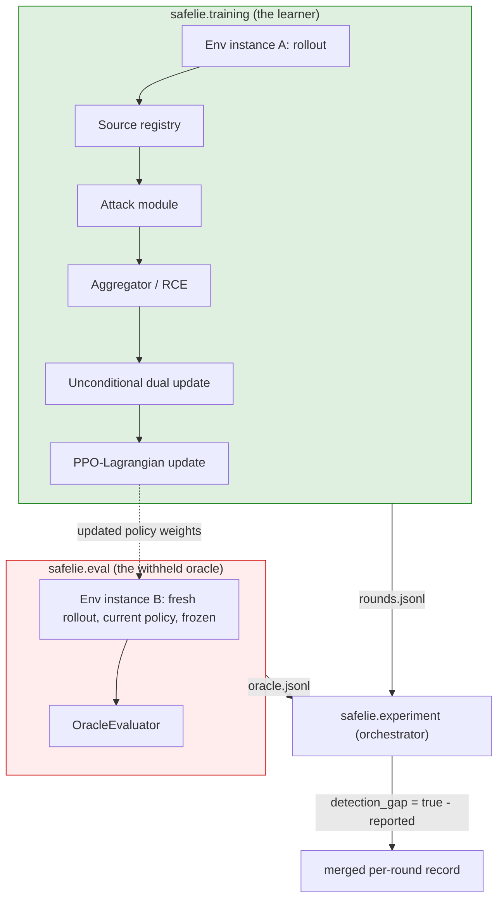
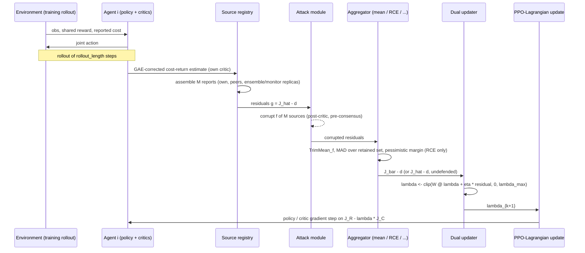

# Architecture

This describes what is actually implemented in `src/safelie/`, not an
aspirational design. Report reference: `PROJECT_REPORT.md` §4.

## Component map

| Component | Module | Role |
|---|---|---|
| Environment + dual-cost contract | `safelie.envs` | Steps the joint action, emits shared reward, per-agent reported cost; isolates true cost behind a capability handle |
| Policy / critics | `safelie.algos.networks` | Per-agent Gaussian policy, reward critic, cost critic (all independent — decentralized, not centralized-critic) |
| Source registry | `safelie.sources` | Assembles the M reports per constraint with typed provenance and independence classes |
| Consensus | `safelie.consensus` | Doubly stochastic mixing matrices for 6 topologies |
| Attack module | `safelie.attacks` | The 4-axis taxonomy as composable operators, applied at the return-scale residual, plus a ground-truth ledger |
| Defense module | `safelie.defenses` | mean / coordinate median / Krum / trimmed mean / RCE, one dispatch point |
| Dual updater | `safelie.training.dual` | Unconditional, projected multiplier update — no gate, ever |
| Training loop (the learner) | `safelie.training.loop` | Ties rollout → sources → attack → aggregate → dual update → PPO update together; **never touches true cost** |
| Oracle evaluator | `safelie.eval.oracle`, `safelie.eval.harness` | Computes true cost from a privileged, structurally separate rollout |
| Orchestrator | `safelie.experiment` | The only module that sees both the learner's and the evaluator's output for the same round |
| Governance | `safelie.governance` | The `SourceAuditor` — the M≥2f+1 checklist, over independence classes |
| Analysis | `safelie.analysis` | Welch/Holm statistics (gated to ≥5 seeds), measured-only summary tables |

## The isolation boundary (the load-bearing design decision)

The paper's central empirical quantity, the **detection gap**
(`J_true_C - J_reported_C`), is meaningless if the learner can see true
cost — the comparison would be circular. This repository enforces the
boundary at three levels, not one:

1. **Structural**: `DualCostStep` (what every environment step returns to
   the learner) has no `true_cost` field at all — there is no attribute,
   dict key, or `info` entry to accidentally read. `safelie.envs.dual_cost`.
2. **Capability-based**: `env.oracle_handle()` — the only *public* way to
   ask an environment for true cost — always returns a sealed view whose
   `.true_cost()` raises `LearnerAccessError`. The one privileged
   constructor, `env._oracle_handle_privileged()`, is not part of the
   `DualCostEnvWrapper` protocol at all. `safelie.envs.guards`.
3. **Structural separation of the two rollouts**: `safelie.training.loop`
   (the learner) never imports `safelie.eval.oracle` and never calls the
   privileged handle — verified by an AST-level grep test, not a
   docstring promise (`tests/isolation/test_oracle_isolation.py`). The
   oracle's evaluation is a **second, independent rollout** run by
   `safelie.experiment` (the orchestrator) using the *current* (frozen)
   policy weights, after the learner has already finished its own
   rollout and update for that round. This mirrors the paper's own
   framing of the oracle as an external evaluator, not a hidden channel
   inside the training loop.

## Data flow within one learner round

## Why the environment is synthetic, not Safe MAMuJoCo

`safelie.envs.synthetic.SyntheticConstrainedMarlEnv` implements the exact
`DualCostEnvWrapper` contract a real MuJoCo adapter would, on a small
hand-built control problem (each agent drives a scalar state toward zero
under a shared reward, with per-agent cost equal to squared action norm).
It exists solely so every other component — sources, attacks, defenses,
the dual update, the oracle — can be exercised end to end on a laptop
CPU, per `PROJECT_REPORT.md`'s own Stage 1 (local, CPU-only) vs. Stage 2
(Colab GPU) split. See `safelie/envs/mamujoco.py` for what a real adapter
needs, and `docs/paper_implementation_mapping.md` for this component's
status.

## Configuration

Pydantic v2 models over YAML (`safelie.utils.config`), not Hydra. The
report suggests Hydra; this repository does not run Hydra-style
multi-run sweeps (the compute for the paper's 300+ run grid is not
available), so Hydra's sweep machinery would add dependency weight for
no benefit. Every CRITICAL cross-field rule the report calls out —
`effective_M > 2f` for trimmed-mean-family defenses, topology/environment
agent-count agreement, attack `f` not exceeding source count — is
enforced by a Pydantic validator at construction time, before any
environment, policy, or source is built.
